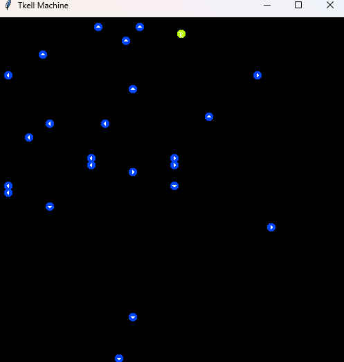
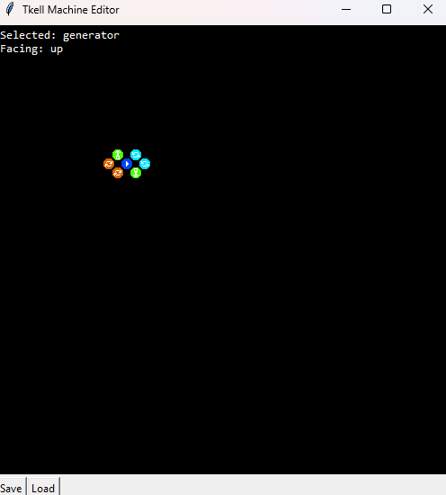
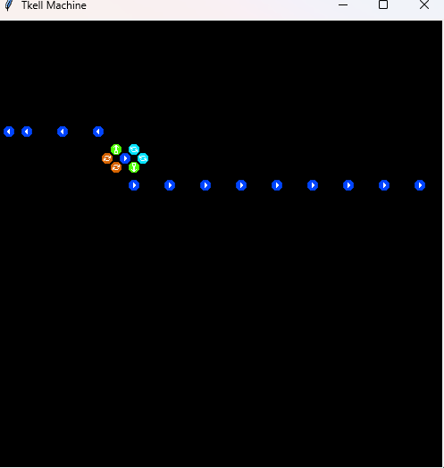

# Tkell Machine

Welcome to Tkell Machine's README!

Here you'll figure out Tkell Machine.

## What is it?
Tkell Machine is a remake of Cell Machine in Python and, of course, Tkinter!
That's why Tk is in the name. Tkinter.

Tkell Machine is not Pyll Machine by the way.

## Tkinter isn't for games.
I know. So I used Tkinter Canvas instead of Pygame!

## What do I need?
You need Python, Tkinter if not installed already, and Pillow.

Python: [Python](https://python.org) if not installed already

Tkinter: Python installer or `sudo apt install python3-tk` or stuff.

Pillow: `pip` has it. `pip install pillow`

Run it using `py` or `python` or `python3` then `main.py` or `editor.py`!

## I would like screenshots before I use up a few megabytes.

